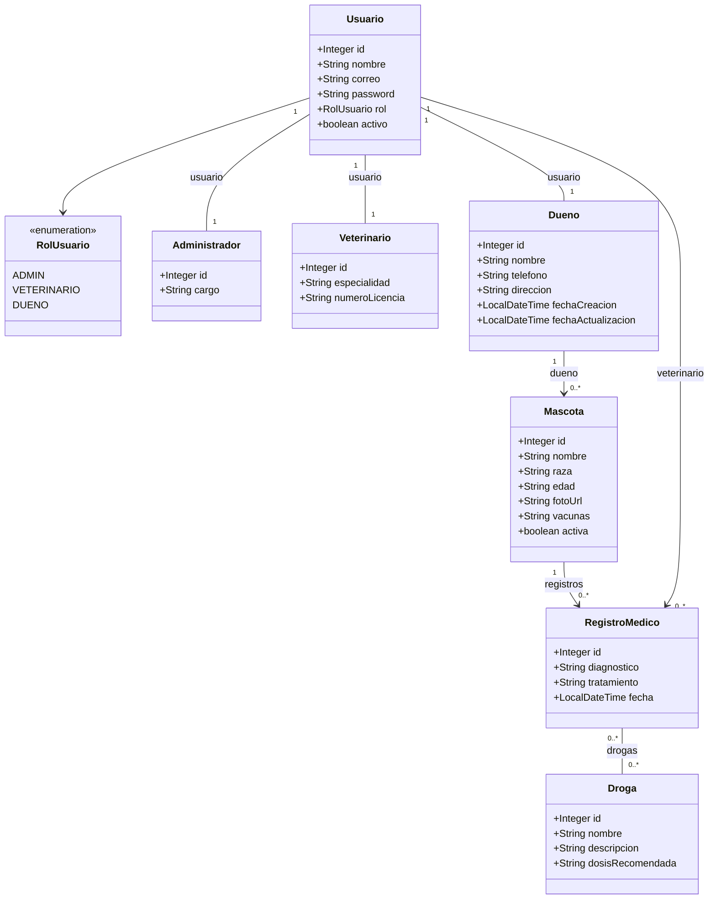
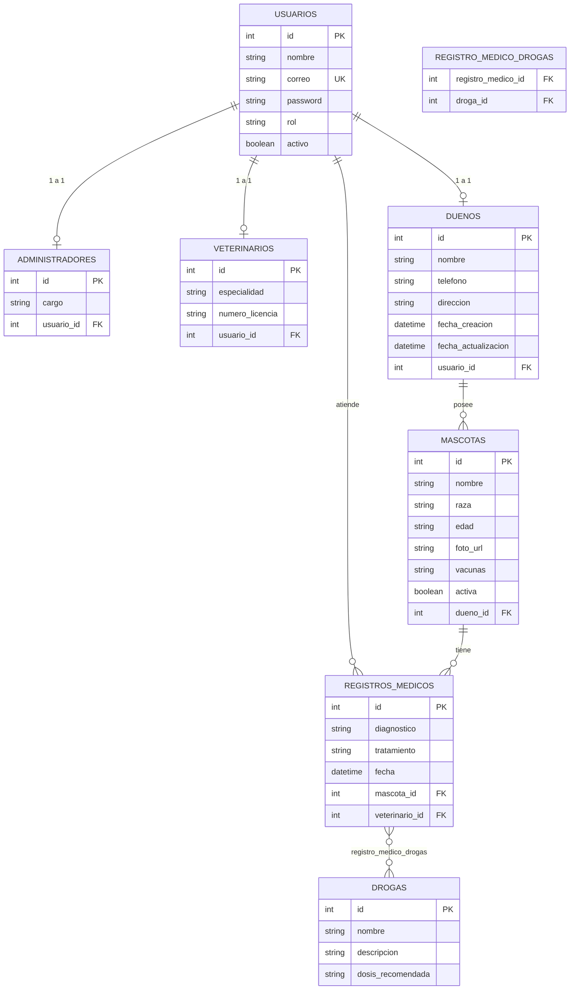

# DogTor 🐾 - Clínica Veterinaria

**La solución definitiva, elegante y responsiva para la gestión integral de una clínica veterinaria.**

DogTor es una plataforma web completa que permite gestionar administradores, veterinarios, clientes, mascotas y su registro médico (diagnósticos, tratamientos y drogas), todo construido sobre una arquitectura MVC sólida y eficiente.

---

## ⚡ Quick Start

Clona el repositorio y levanta el proyecto en segundos usando Spring Boot.

```bash
git clone https://github.com/Samuelyopez/Desarrollo-Web.git
cd Desarrollo-Web/Sprint3
mvnw spring-boot:run
```

Una vez que el servidor inicie, visita `http://localhost:8080` en tu navegador.

---

## 📖 Introduction

Este proyecto representa el *Sprint 4* del desarrollo de la web para la clínica veterinaria DogTor.
Se enfoca en integrar un diseño atractivo (UI/UX) utilizando Tailwind CSS y Bootstrap, junto con un robusto backend en Java (Spring Boot) para persistencia de datos (H2) y plantillas dinámicas (Thymeleaf).

## 🛠 Prerequisites

Para ejecutar y modificar este proyecto necesitas:

- **Java 17** o superior
- **Maven** (o usar el wrapper `mvnw` incluido)
- Conexión a internet (para descargar dependencias como Tailwind y Alpine.js desde CDN)

## 🏗 Architecture Details

DogTor sigue un patrón de diseño **MVC (Model-View-Controller)**:

- **Frontend (View)**: 
  - Renderizado del lado del servidor con **Thymeleaf**.
  - Estilizado utilizando **Tailwind CSS** (vía CDN) y un módulo específico en **Bootstrap 5** (página Nosotros).
  - Interactividad del lado del cliente (ej. buscador de dueño, listas desplegables) manejada con **Alpine.js**.
- **Backend (Controller & Service)**:
  - Spring Boot 3 gestionando las peticiones HTTP (`WebController`, `AdminController`, `VeterinarioController`, `MascotaController`).
  - Servicios de negocio separados (`MascotaService`, `DuenoService`, `VeterinarioService`, `AdministradorService`, `DrogaService`, `RegistroMedicoService`, `UsuarioService`).
- **Database (Model)**:
  - Base de datos relacional **H2** en modo archivo persistente (`veterinariadb.mv.db`).
  - ORM manejado a través de **Spring Data JPA / Hibernate**.
  - Inicialización automática de datos dummy mediante `DataInitializer.java` (si la BD está vacía).

### Estructura de Páginas

| Ruta | Descripción |
|---|---|
| `/` | Landing page principal con carrusel de navegación |
| `/nosotros` | Historia de la clínica (Bootstrap 5) |
| `/equipo` | Perfil y especialidades de nuestros doctores |
| `/planes` | Planes de atención de la clínica |
| `/pacientes` | Portal de mascotas del cliente (tarjetas + detalle) |
| `/login` | Acceso seguro para clientes, veterinarios y administradores |
| `/admin` | Panel de administración (clientes, mascotas, veterinarios) |
| `/veterinario` | Panel de veterinario (clientes, mascotas, registro médico) |

## ✅ Expected Results

Al ejecutar la aplicación por primera vez:
1. La base de datos `veterinariadb.mv.db` se generará localmente.
2. Spring Boot inyectará automáticamente 5 administradores, 5 veterinarios, 6 dueños, 16 mascotas y 5 drogas.
3. Podrás navegar fluidamente por todas las pestañas, iniciar sesión con cualquiera de los roles y probar el CRUD de cada panel.

## ⚠️ Troubleshooting

- **Problema**: Los datos no aparecen actualizados tras un cambio en el modelo.
  - **Solución**: Detén el servidor, elimina el archivo `veterinariadb.mv.db` en la carpeta raíz y reinicia. Esto forzará al `DataInitializer` a repoblar la base de datos con la última estructura.
- **Problema**: `java.net.BindException: Address already in use`.
  - **Solución**: El puerto 8080 está ocupado. Cierra cualquier otra aplicación corriendo en ese puerto o cambia `server.port=8081` en `application.properties`.

## 📐 Diagrama de clases

Cada tipo de usuario (`Administrador`, `Veterinario`, `Dueno`) es una entidad propia con su propia tabla, envolviendo un `Usuario` (identidad/login) vía relación 1:1.



**Notas del modelo**
- Eliminar un `Dueno` elimina en cascada sus `Mascota` y, con ellas, sus `RegistroMedico` (`Mascota.registros` con `cascade=ALL, orphanRemoval=true`).
- `Mascota.activa` representa si la mascota está en la clínica o en casa; es independiente del ciclo de vida del dueño.
- Solo se puede agregar `RegistroMedico` a mascotas activas.

## 📐 Diagrama entidad-relación



## 🎨 Paleta de colores

| Rol | Nombre Tailwind | Hex | Uso |
|---|---|---|---|
| 🟢 Primario | `primary` | `#2A9D8F` | Marca, títulos, enlaces activos, botones principales |
| 🟠 Secundario | `secondary` | `#F4A261` | Botones de acción (Guardar, Ver Detalle, CTAs) |
| 🟡 Acento | `accent` | `#E9C46A` | Botones secundarios (Editar), resaltados |
| ⚪ Fondo claro | `bglight` | `#FAFAFA` | Fondo general de la aplicación |
| ⚫ Texto oscuro | `textdark` | `#264653` | Texto principal, footers |

Colores de estado (Tailwind estándar, sin personalizar):
- Éxito / activo: `green-100` / `green-600` / `green-700`
- Alerta / eliminar: `red-100` / `red-500` / `red-700`
- Neutral / inactivo: `gray-100` a `gray-600`

## 📚 Additional Resources

- [Spring Boot Reference Guide](https://docs.spring.io/spring-boot/docs/current/reference/htmlsingle/)
- [Tailwind CSS Documentation](https://tailwindcss.com/docs)
- [Alpine.js Documentation](https://alpinejs.dev/)
