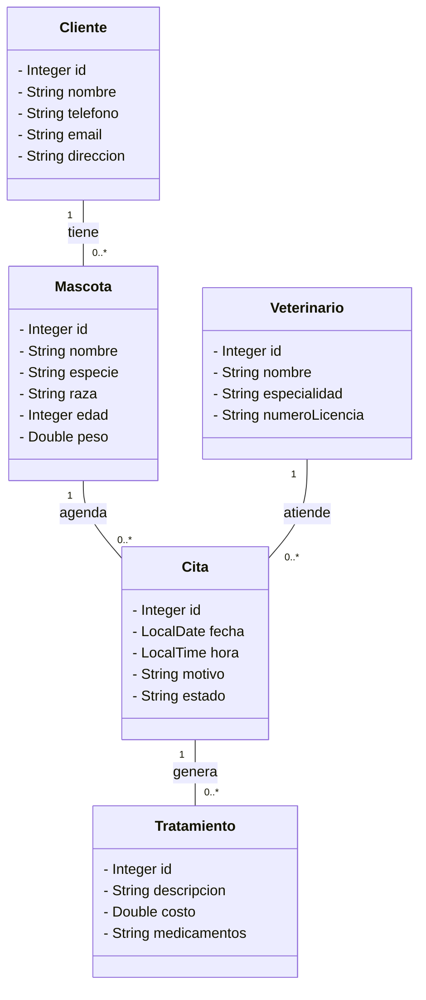

# Diagrama de Clases UML - DogTor

El siguiente diagrama representa la estructura de clases principal para la clínica veterinaria **DogTor**, omitiendo los getters y setters según lo solicitado en los requisitos del Sprint 1.

Este modelo inicial se usará para construir las entidades (POJOs) en los sprints futuros utilizando Spring Boot y las anotaciones de Lombok.
